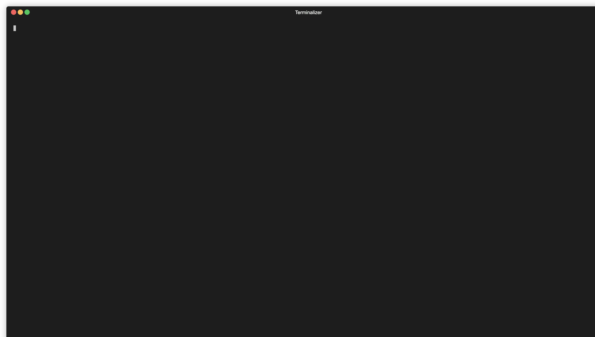
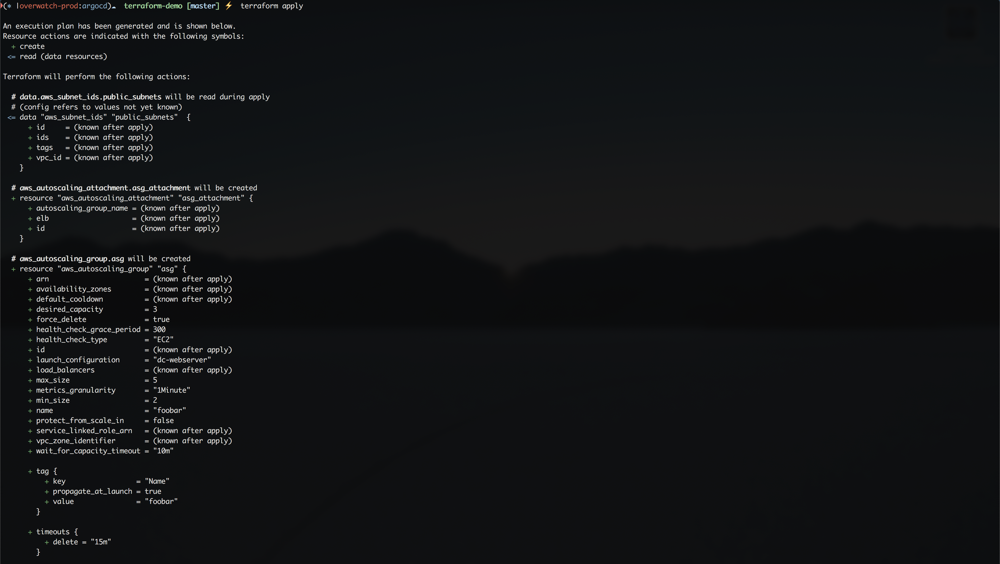

<a href="https://github.com/fmdlc/">

</a>

# Terraform-demo
   
> This set of [Terraform](https://www.terraform.io/) HCL files, pretends to be only examples for training purposes. It's a straightforward exercise
to introduce people into the Terraform world.

[ LinkedIn](https://www.linkedin.com/in/fmdlc)
&nbsp;
[ GitHub](https://github.com/fmdlc)
## Setup

1) Create a public/private SSH keypair and store it under your `~/.ssh/` directory.
2) Download [Terraform v0.13.0](https://www.terraform.io/downloads.html) for your Operating System.
3) Login into your AWS account, crete a IAM user, then create a set of IAM credentials and store them in a safe place.
4) Configure your AWS environment (be sure to have the `aws CLI` tool installed).
5) Configure [AWS CLI](https://docs.aws.amazon.com/cli/latest/userguide/cli-chap-install.html): ```aws config```and enter the IAM credentials that you created before.
6) Edit the `variables.tf` file and update the variable `allowed_ip_addr` with your public IP address in order to be 
allowed to connect to EC2 Instances.
7) Create an empty [S3 bucket](https://docs.aws.amazon.com/AmazonS3/latest/user-guide/create-bucket.html) in the `us-east-1` AWS region, make it private and use the created bucket name to configure the `backend.tf`.
8) Execute [terraform init](https://www.terraform.io/docs/commands/init.html) to initialize the providers.

## How to run
##### Initialize terraform
```hcl-terraform
$: terraform init
```
<p align="center">
  <a href="https://github.com/fmdlc/">
    
  </a>
</p>

##### Create a Terraform plan
```hcl-terraform
$: terraform plan
```
<p align="center">
  <a href="https://github.com/fmdlc/">
    
  </a>
</p>

#### Applying the plan
```hcl-terraform
$: terraform apply
``` 
<p align="center">
  <a href="https://github.com/fmdlc/">
    
  </a>
</p>

#### Clean up
```
$: terraform destroy
```

## Contributing
Pull requests are welcome. For major changes, please open an issue first to discuss what you would like to change.

Please make sure to update tests as appropriate.

## License
[MIT](https://choosealicense.com/licenses/mit/)
